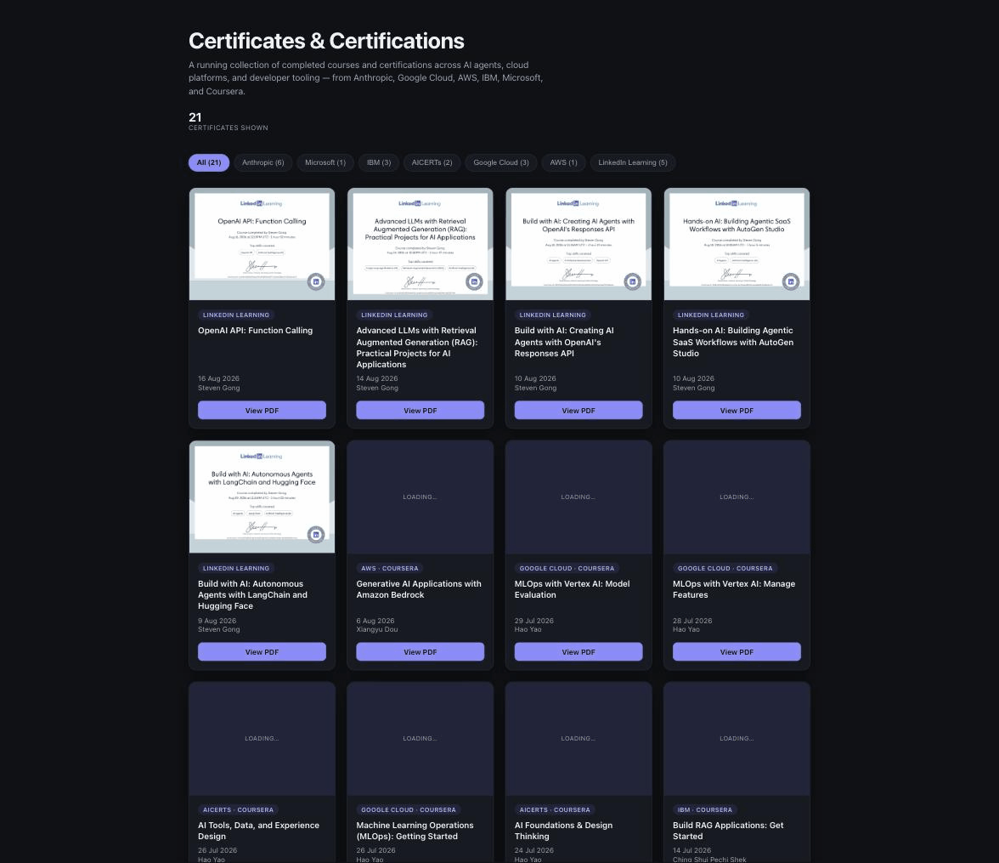

# Certificates

A running collection of completed courses and certifications across AI agents, cloud platforms,
and developer tooling. 30 certificates from Anthropic, Microsoft, IBM, Google Cloud, AWS,
AICERTs, and LinkedIn Learning. Filterable, with PDF thumbnails.

## Certificates

| Certificate | Issuer |
| --- | --- |
| [Building AI Products: Security Essentials](certs/LinkedIn_Building%20AI%20Products%20Security%20Essentials%20Professional%20Certificate%20by%20LinkedIn%20Learning.pdf) | LinkedIn Learning |
| [AI Product Security: Testing, Validation, and Maintenance](certs/LinkedIn_AI%20Product%20Security%20Testing%20Validation%20and%20Maintenance.pdf) | LinkedIn Learning |
| [Building Agentic AI Systems for Developers](certs/Building_Agentic_AI_Systems_for_Developers/A_CertificateOfCompletion_Building%20Agentic%20AI%20Systems%20for%20Developers.pdf) | LinkedIn Learning |
| [Operating AI Agents: Failure and Recovery](certs/Building_Agentic_AI_Systems_for_Developers/Operating_AI_Agents_Failure_and_Recovery.pdf) | LinkedIn Learning |
| [Governing AI Agents: Visibility and Control](certs/Building_Agentic_AI_Systems_for_Developers/Governing_AI_Agents_Visibility_and_Control.pdf) | LinkedIn Learning |
| [AI Evaluations: Foundations and Practical Examples](certs/Building_Agentic_AI_Systems_for_Developers/AI_Evaluations-_Foundations_and_Practical_Examples.pdf) | LinkedIn Learning |
| [Build with AI: Agentic Applications with LlamaIndex and MCP](certs/Building_Agentic_AI_Systems_for_Developers/Build_with_AI_Agentic_Applications_with_LlamaIndex_and_MCP.pdf) | LinkedIn Learning |
| [Hands-On AI: Building AI Agents with Model Context Protocol (MCP) and Agent2Agent (A2A)](certs/Building_Agentic_AI_Systems_for_Developers/Building_AI_Agents_with_Model_Context_Protocol_MCP_and_Agent2Agent_A2A.pdf) | LinkedIn Learning |
| [Model Context Protocol (MCP): Hands-On with Agentic AI](certs/Building_Agentic_AI_Systems_for_Developers/Model_Context_Protocol_MCP_HandsOn_with_Agentic_AI.pdf) | LinkedIn Learning |
| [OpenAI API: Function Calling](certs/Building_Agentic_AI_Systems_for_Developers/OpenAI_API_Function_Calling.pdf) | LinkedIn Learning |
| [Advanced LLMs with Retrieval Augmented Generation (RAG): Practical Projects for AI Applications](certs/Building_Agentic_AI_Systems_for_Developers/CertificateOfCompletion_Advanced%20LLMs%20with%20Retrieval%20Augmented%20Generation%20RAG%20Practical%20Projects%20for%20AI%20Applications.pdf) | LinkedIn Learning |
| [Hands-on AI: Building Agentic SaaS Workflows with AutoGen Studio](certs/Building_Agentic_AI_Systems_for_Developers/Handson_AI_Building_Agentic_SaaS_Workflows_with_AutoGen_Studio.pdf) | LinkedIn Learning |
| [Build with AI: Creating AI Agents with OpenAI's Responses API](certs/Building_Agentic_AI_Systems_for_Developers/Creating_AI_Agents_with_OpenAIs_Responses_API.pdf) | LinkedIn Learning |
| [Build with AI: Autonomous Agents with LangChain and Hugging Face](certs/AI_Autonomous_Agents_with_LangChain_and_Hugging_Face.pdf) | LinkedIn Learning |
| [Generative AI Applications with Amazon Bedrock](certs/Generative_AI_Applications_with_Amazon_Bedrock_Coursera.pdf) | AWS · Coursera |
| [MLOps with Vertex AI: Model Evaluation](certs/Machine_Learning_Operations_with_Vertex_AI_Model_Evaluation.pdf) | Google Cloud · Coursera |
| [MLOps with Vertex AI: Manage Features](certs/Machine_Learning_Operations_%28MLOps%29_with_Vertex_AI_Manage_Features.pdf) | Google Cloud · Coursera |
| [AI Tools, Data, and Experience Design](certs/AI-Tools-Data-and-Experience-Design.pdf) | AICERTs · Coursera |
| [Machine Learning Operations (MLOps): Getting Started](certs/Machine-Learning-Operations-%28MLOps%29.pdf) | Google Cloud · Coursera |
| [AI Foundations & Design Thinking](certs/AI-Foundations-Design-Thinking-Coursera.pdf) | AICERTs · Coursera |
| [Build RAG Applications: Get Started](certs/IBM-Build-RAG-Applications.pdf) | IBM · Coursera |
| [Develop Generative AI Applications: Get Started](certs/IBM-Develop-Generative-AI-Applications.pdf) | IBM · Coursera |
| [Microsoft Azure AI Essentials](certs/Microsoft/Microsoft_Azure_AI_Essentials.pdf) | Microsoft & LinkedIn Learning |
| [Agentic AI with LangChain and LangGraph](certs/Building_Agentic_AI_Systems_for_Developers/Agentic_AI_with_LangChain_and_LangGraph.pdf) | IBM · Coursera |
| [Introduction to Agent Skills](certs/Claude/certificate-ClaudeAgentSkills.pdf) | Anthropic |
| [Claude with the Anthropic API](certs/Claude/certificate-Claude-API.pdf) ([verify](https://verify.skilljar.com/c/9oj4qrpkfonv)) | Anthropic |
| [Introduction to Claude Cowork](certs/Claude/certificate-ClaudeCowork.pdf) | Anthropic |
| [Claude Code 101](certs/Claude/certificate-ClaudeCode101.pdf) | Anthropic |
| [Claude 101](certs/Claude/certificate-Cloud101.pdf) | Anthropic |
| [Claude Code in Action](certs/Claude/certificate-CloudCodeInAction.pdf) ([verify](https://verify.skilljar.com/c/5dy2czq2nhsf)) | Anthropic |

---

Certificate PDFs live under `certs/`, grouped by issuer. The gallery is a static page
(`index.html` + `assets/certs.js`) rendered with client-side PDF thumbnails via
[pdf.js](https://mozilla.github.io/pdf.js/) — no build step. To add a certificate: drop the PDF
into `certs/`, add an entry to `assets/certs.js`, commit.
